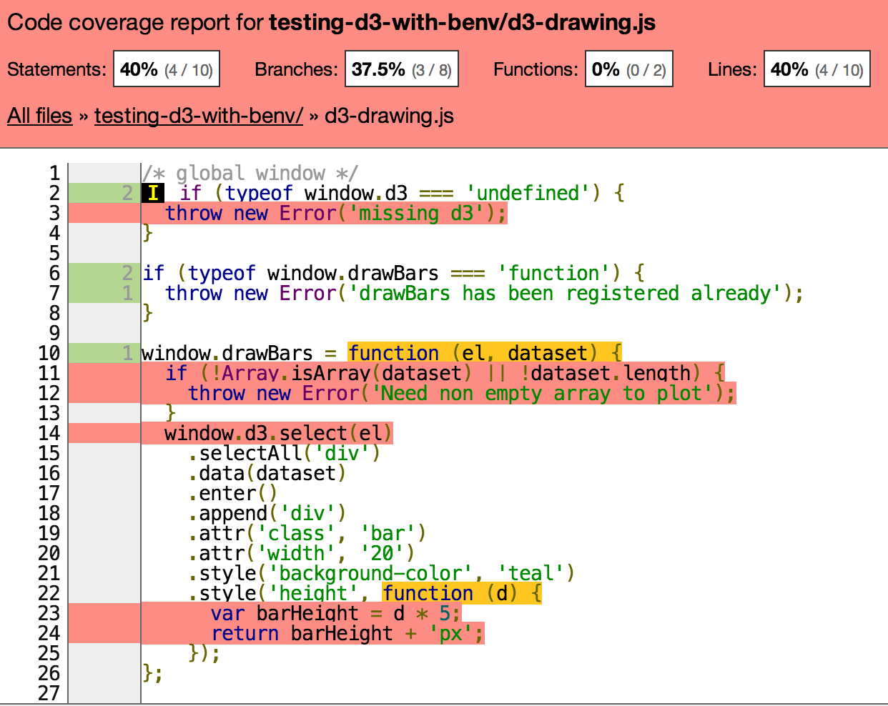

# testing-d3-with-benv

Testing D3 event functions from command line without an actual browser.

[source file](d3-drawing.js), [unit test file](d3-gt-test.js)

install:

    npm install
    grunt
    npm test // runs unit tests

Previous parts:

* [Step 1 - DOM testing](https://github.com/bahmutov/testing-d3-with-benv/tree/dom-testing)
* [Step 2 - simple D3 testing](https://github.com/bahmutov/testing-d3-with-benv/tree/d3-testing)
* [Step 3 - D3 user function testing](https://github.com/bahmutov/testing-d3-with-benv/tree/d3-function-testing)
* [Step 4 - D3 event testing](https://github.com/bahmutov/testing-d3-with-benv/tree/d3-mouseover-testing)

## Step 5 - testing D3 code load

The usual unit testing approach in the browser loads all code synchronously
before the test runner starts. For example, if the test code is in *tests.js*, it is loaded
after the D3 drawing code to be tested in *d3-drawing.js* but before the tests are run

```html
<head>
  <script src="path/to/jasmine"></script>
  <script src="d3-drawing.js"></script>
  <script src="tests.js"></script>
</head>
<body>
  // DOM fixtures
  <script>
    (function () {
      var jasmineEnv = jasmine.getEnv();
      // more jasmineEnv setup
      window.onload = function () {
        jasmineEnv.execute(); // runs unit tests
      }
    })();
  </script>
</body>
```

What if our D3 drawing includes initialization we would like to test?
For example, [d3-drawing.js](d3-drawing.js) includes registering global function that
throws an exception if we try to load the file twice.

```js
if (typeof window.drawBars === 'function') {
  throw new Error('drawBars has been registered already');
}
window.drawBars = function () { ... };
```

We could of course write an async unit test, attach the script tag to the document again, etc.
But even a try catch around the script loader might not clean up the global DOM / fixture.
Using synthetic [jsdom](https://github.com/tmpvar/jsdom) makes the problem much simpler
because each test completely blows away the DOM / document / window!
Here how we test if trying to load *d3-drawing.js* twice raises an Error.

```
// d3-gt-test.js
QUnit.test('try loading drawing code twice', function () {
  QUnit.raises(function () {
    benv.require('./d3-drawing.js');
    benv.require('./d3-drawing.js');
  }, Error, 'cannot load drawing code second time');
});
```

Here is the coverage saved into `cover/lcov-report/index.html` after the test run



As you can see line `if (typeof window.drawBars === 'function') {` was executed twice,
and the error throwing line once.

## Small print

Author: Gleb Bahmutov &copy; 2014

* [@bahmutov](https://twitter.com/bahmutov)
* [glebbahmutov.com](http://glebbahmutov.com)
* [blog](http://bahmutov.calepin.co/)

License: MIT - do anything with the code, but don't blame me if it does not work.

Spread the word: tweet, star on github, etc.

Support: if you find any problems with this module, email / tweet /
[open issue](https://github.com/bahmutov/testing-d3-with-benv/issues) on Github
