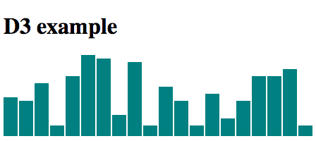
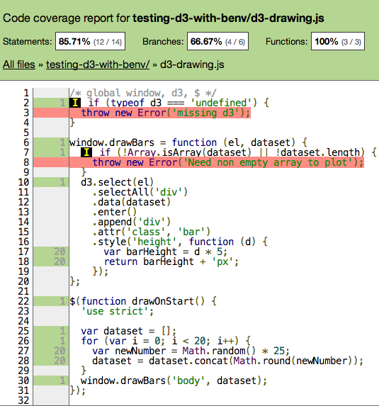

# testing-d3-with-benv

Simple D3 testing from command line without an actual browser.

install:

    npm install
    grunt

For basics of DOM testing without a browser using synthetic environment,
see [Step 1 - dom-testing branch](https://github.com/bahmutov/testing-d3-with-benv/tree/dom-testing)

## Step 2 - testing D3 example

### drawing setup

Lets write a small D3 function that creates a bar chart
given an array of numbers. The HTML document is really simple [index.html](index.hml)

```html
<!DOCTYPE html>
<html lang="en-us">
<head>
<meta charset="utf-8">
<title>d3 testing using benv</title>
<script src="bower_components/jquery/dist/jquery.js"></script>
<script src="bower_components/d3/d3.js"></script>
<script src="d3-drawing.js"></script>
<style>
div.bar {
    display: inline-block;
    width: 20px;
    height: 75px;
    background-color: teal;
    margin-right: 2px;
}
</style>
... drawing will be here
</head>
<body>
    <h1>D3 example</h1>
</body>
</html>
```

The drawing code in [d3-drawing.js](d3-drawing.js) registers a function `drawBars`

```js
window.drawBars = function (el, dataset) {
  if (!Array.isArray(dataset) || !dataset.length) {
    throw new Error('Need non empty array to plot');
  }
  window.d3.select(el)
    .selectAll('div')
    .data(dataset)
    .enter()
    .append('div')
    .attr('class', 'bar')
    .style('height', function (d) {
      var barHeight = d * 5;
      return barHeight + 'px';
    });
};
```

The `window.drawBars` is used from `index.html` to draw on document ready event

```html
<script>
$(function drawOnStart() {
  'use strict';

  var dataset = [];
  for (var i = 0; i < 20; i++) {
    var newNumber = Math.random() * 25;
    dataset = dataset.concat(Math.round(newNumber));
  }
  window.drawBars('body', dataset);
});
</script>
```

The result is something like this



## testing

Let's write tests to verify that:

1. Drawing function `drawBars` raises an exception without data argument.
2. The drawing does create the correct number of bar DIV nodes

I picked [gt](https://github.com/bahmutov/gt) because it has
good async test support and built-in code coverage by default.
The tests will use [QUnit](http://qunitjs.com/) TDD syntax. Before each test
we will initialize the DOM environment using benv, which requires an async
code execution. GT supports async module setup functions that return promises.

You can run unit tests using command `npm test`

### test environment

```js
var Q = require('q');
var benv = require('benv');
QUnit.module('d3-drawing.js', {
  setup: function () {
    var defer = Q.defer();
    benv.setup(function () {
      benv.expose({
        $: benv.require('./bower_components/jquery/dist/jquery.js')
      });
      window.d3 = benv.require('./bower_components/d3/d3.js');
      defer.resolve();
    });
    return defer.promise;
  },
  teardown: function () {
    benv.teardown();
  }
});
```

Note that jQuery and D3 are loaded differently. jQuery attaches itself to global object
as $ symbol and is available everywhere, including the unit tests. We are attaching D3 object
to the `window` object explicitly to make sure this is consistent with what a browser would do.
Since we are going to execute the D3 drawing code from node environment we need to
use `window.d3` and not just `d3`. A good pattern is to create an IIFE just for this purpose

```js
(function (d3) {
  window.drawBars = function (el, dataset) {
    if (!Array.isArray(dataset) || !dataset.length) {
      throw new Error('Need non empty array to plot');
    }
    d3.select(el)
      .selectAll('div')
      .data(dataset)
      .enter()
      .append('div')
      .attr('class', 'bar')
      .attr('width', '20')
      .style('height', function (d) {
        var barHeight = d * 5;
        return barHeight + 'px';
      });
  };
}(window.d3));
```

Node module system caches the loaded modules after evaluation.
Since we need to load the modules from fresh before
each unit test, we use `benv.require` call.

### unit tests

We can check if the environment has been initialized correctly

```js
QUnit.test('window', function () {
  QUnit.equal(typeof window, 'object', 'window exists');
});

QUnit.test('jQuery $', function () {
  QUnit.equal(typeof $, 'function', '$ exists');
});

QUnit.test('window.d3', function () {
  QUnit.equal(typeof window.d3, 'object', 'window.d3 exists');
});
```

We can also check if the D3 code is working:

```js
QUnit.test('draws 20 bars', function () {
  // load d3-drawing.js and avoid caching by the node runtime
  benv.require('./d3-drawing.js');
  QUnit.equal(typeof window.drawBars, 'function', 'drawBars function registered');
  window.drawBars('body', [5, 10]);

  QUnit.equal($('div.bar').length, 2, 'D3 created correct number of div bars');
  // more assertions that inspect individual bars
});
```

D3 is nothing but DOM manipulator, so any time you would like to see the current
document structure, just log the body of the document

```js
// inside unit test
window.drawBars('body', [5, 10]);
// sometime later
console.log($('body').html());
```

Hint: use [js-beautify](https://github.com/einars/js-beautify) to output nicely
formatted structure instead of text dump.

### Checking exceptions

Let's test how the `window.drawBars` throws an exception if called without data

```js
QUnit.test('trying to call without data', function () {
  QUnit.raises(function () {
    benv.require('./d3-drawing.js');
    window.drawBars('body');
  }, 'Error', 'Raises error without data');
});
```

Notice that this test is synchronous because the exception is raised
right away.

### running unit tests

You can run unit tests using `npm test` command.
It should show something similar to this:

```
$ npm test

> testing-d3-with-benv@0.0.0 test /Users/gleb/git/testing-d3-with-benv
> node node_modules/gt/gt.js d3-gt-test.js -o

please wait a couple of seconds, instrumenting D3 and jQuery takes time
15:52:03 - info:    starting test "draws 20 bars"
========================== /Users/gleb/git/testing-d3-with-benv/d3-gt-test.js ===========================
d3-drawing.js 39ms
  draws 20 bars                                                               100% (1 / 1) : PASS
    /Users/gleb/git/testing-d3-with-benv/d3-gt-test.js                          100% (1 / 1)
=========================================================================================================
100% (1 / 1) tests passed
------------------------------------------------------+-----------+-----------+-----------+-----------+
File                                                  |   % Stmts |% Branches |   % Funcs |   % Lines |
------------------------------------------------------+-----------+-----------+-----------+-----------+
   testing-d3-with-benv/                              |     93.33 |     66.67 |       100 |     93.33 |
      d3-drawing.js                                   |     85.71 |     66.67 |       100 |     85.71 |
      d3-gt-test.js                                   |       100 |       100 |       100 |       100 |
   testing-d3-with-benv/bower_components/d3/          |     16.77 |      2.25 |       4.8 |     18.54 |
      d3.js                                           |     16.77 |      2.25 |       4.8 |     18.54 |
   testing-d3-with-benv/bower_components/jquery/dist/ |     22.72 |     10.82 |     19.25 |     22.72 |
      jquery.js                                       |     22.72 |     10.82 |     19.25 |     22.72 |
------------------------------------------------------+-----------+-----------+-----------+-----------+
All files                                             |     18.85 |       6.6 |      9.13 |     20.18 |
------------------------------------------------------+-----------+-----------+-----------+-----------+
```

You can see that the unit test has passed, and the test runner computed coverage information for all
loaded files. You can open `cover/lcov-report/index.htm` in a browser to see line by line
coverage information. For example for `d3-drawing.js` it shows the correct number of times each line
has been called while creating 20 bars



## Small print

Author: Gleb Bahmutov &copy; 2014

* [@bahmutov](https://twitter.com/bahmutov)
* [glebbahmutov.com](http://glebbahmutov.com)
* [blog](http://bahmutov.calepin.co/)

License: MIT - do anything with the code, but don't blame me if it does not work.

Spread the word: tweet, star on github, etc.

Support: if you find any problems with this module, email / tweet /
[open issue](https://github.com/bahmutov/testing-d3-with-benv/issues) on Github
