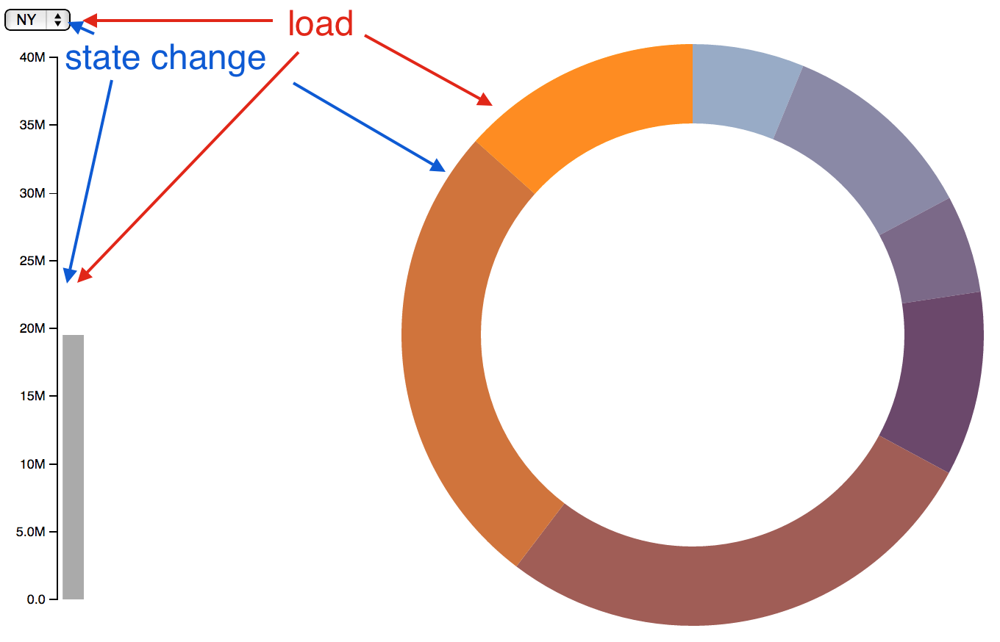
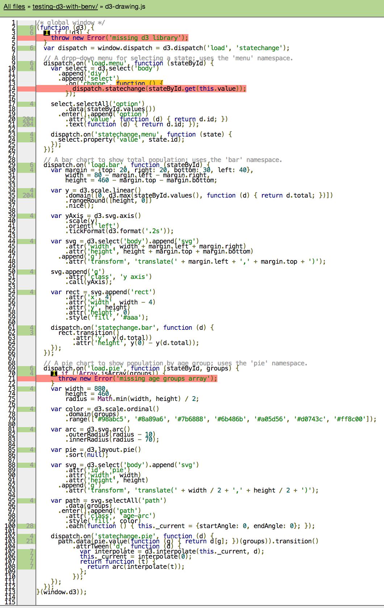

# testing-d3-with-benv

Testing D3 event functions from command line without an actual browser.

[index.html](index.html), [d3 source file](d3-drawing.js), [unit test file](d3-gt-test.js)

This is a refactoring for CLI testability of the
["Dispatching events"](http://bl.ocks.org/mbostock/5872848) example.

This little application loads population data from [data.csv](data.csv)
and creates 3 entities: drop down selection with US states (plus District of Columbia),
bar chart to show the total population of a chosen state, plus doughnut chart
with the number of state's residents per age bracket. It uses a
[d3.dispatch](https://github.com/mbostock/d3/wiki/Internals#d3_dispatch)
object to route custom events among the 3 entities. The final look and feel are
below



### install

    npm install
    grunt
    npm test // runs unit tests

Previous parts:

* [Step 1 - DOM testing](https://github.com/bahmutov/testing-d3-with-benv/tree/dom-testing)
* [Step 2 - simple D3 testing](https://github.com/bahmutov/testing-d3-with-benv/tree/d3-testing)
* [Step 3 - D3 user function testing](https://github.com/bahmutov/testing-d3-with-benv/tree/d3-function-testing)
* [Step 4 - D3 event testing](https://github.com/bahmutov/testing-d3-with-benv/tree/d3-mouseover-testing)
* [Step 5 - D3 load test](https://github.com/bahmutov/testing-d3-with-benv/tree/d3-load-test)

## Step 5 - testing custom D3 events

To improve your web application design, I advise to decouple browser events (click, select, etc)
from business logic events (load data, select item, etc). This significantly simplifies testing.
It is still possible to reach the great majority of the code while removing
need to use (flaky, unsupported, hard to code) synthetic DOM events,
like the one I used in
[Step 4 - D3 event testing](https://github.com/bahmutov/testing-d3-with-benv/tree/d3-mouseover-testing) demo.

This example shows how easy it is to test the decoupled D3 app that uses
[d3.dispatch](https://github.com/mbostock/d3/wiki/Internals#d3_dispatch) instead of
native browser events, while still covering almost all the source code with unit tests.

## testing data load

The initial application loads data using [d3.csv](https://github.com/mbostock/d3/wiki/CSV#csv)
call. When running under node, the XMLHttpRequest is unavailable, but we can just load the file from
the filesystem. We can even load file synchronously, simplifying our testing code.
After loading, we use the standard [d3.csv.parse](https://github.com/mbostock/d3/wiki/CSV#parse)
to convert CSV contents into an array of objects.

```js
// application code
d3.csv('data.csv', type, function(error, states) { ... });
// unit test
var read = require('fs').readFileSync;
var data = read('data.csv', 'utf8');
QUnit.test('CSV file load', function () {
  var states = window.d3.csv.parse(data);
  QUnit.equal(states.length, 51, 'loaded 50 states + Washington, D.C.');
});
```

## coding for testability

Running JavaScript code in the browser has a major disadvantage compared to running under Nodejs.
In the browser, all code gets jammed into single "virtual" global names space, while Nodejs
keeps variables and functions from each file separate and inaccessible from other files.
I agree 100% with the Nodejs approach, because it minimizes accidental variable leaks, overrides and
other hard to debug problems. But for our purposes, it means that something that was accessible
in the browser environment, becomes impossible to test when loading JavaScript files using
Nodejs `require("path/to/filename.js")` call.

Luckily we can easily reengineer our code to first introduce privacy when running in the
browser and then to extract things we need to test when running unit tests under Node.
It is absolutely the best practice to surround all code in your individual JavaScript
files using a function and only export variables that you want shared by attaching
them to the window object. For example see [d3-drawing.js](d3-drawing.js)

```js
// d3-drawing.js
(function (d3) {
  if (!d3) {
    throw new Error('missing d3 library');
  }
  var dispatch = window.dispatch = d3.dispatch('load', 'statechange');
  // use dispatch as usual
  // nothing from this function can accidentally leak to global namespace
}(window.d3));
```

We are exposing `dispatch` object to the outside world. The application logic in [index.html](index.html)
can then use this object to trigger the `load` event

```
// index.html
<script src="d3-drawing.js"></script>
<script>
(function () {
  // Coerce population counts to numbers and compute total per state.
  var groups = [
    "Under 5 Years",
    ...
  ];
  d3.csv('data.csv', type, function(error, states) {
    ...
    // use window.dispatch object
    dispatch.load(stateById, groups);
    dispatch.statechange(stateById.get("CA"));
  });
}());
</script>
```

Notice that we wrapped application code in privacy closure to make sure we are not
leaking `groups` variable. Instead we are passing `groups` as the second argument
to `dispatch.load` call.

## getting the dispatch object

Nodejs modules follow [CommonJs](http://spinejs.com/docs/commonjs) convention.
Everything a module wants public needs to be explicitly listed as a property of
`exports` object. Since our D3 code runs in the browser, the best we can engineer
is to attach public variables to the `window` module. How do we get things
attached to the window inside the loaded files in our unit tests?

By using [benv.require](https://github.com/artsy/benv#benvrequirefilename-globalvarname)
which uses [rewire](https://github.com/jhnns/rewire) to grab specific variables
from JavaScript modules that are not CommonJs. If we attached `dispatch` to the
window, we can load the file and grab it in a unit test like this:

```js
QUnit.test('dispatch methods', function () {
  var dispatch = benv.require('./d3-drawing.js', 'dispatch');
  QUnit.func(dispatch.load, 'dispatch.load is a function');
  QUnit.func(dispatch.statechange, 'dispatch.statechange is a function');
});
```

## Putting it all together

Lets load the CSV file, send an application event to D3 code via
the `dispatch` object and inspect the synthetic page.

```js
QUnit.test('dispatch load.menu', function () {
  var states = window.d3.csv.parse(data, type);
  var stateById = window.d3.map();
  states.forEach(function (d) { stateById.set(d.id, d); });
  var dispatch = benv.require('./d3-drawing.js', 'dispatch');
  dispatch.load(stateById, groups);

  var select = window.d3.select('select');
  var options = select[0][0];
  QUnit.equal(options.length, Object.keys(stateById).length,
    'each state has been added to select drop down');
});
```

If we want to be even more concise, we would move data load and initial massaging
into `QUnit.module setupOnce` function, leaving only the actual call in the unit test.

## Testing pie chart

Let's see how many segments pie chart has. Should be a single
segment per age group. First, let's add a class to each pie chart *path* node
to make the selection easier.

```js
var path = svg.selectAll('path')
  .data(groups)
  .enter().append('path')
    .attr('class', 'age-arc')
    .style('fill', color)
    .each(function () { this._current = {startAngle: 0, endAngle: 0}; });
```

Second, lets add an id to the pie chart

```js
var svg = d3.select('body').append('svg')
  .attr('id', 'pie')
  ...
```

Each state has people in each age group, so the number of path nodes with
class `age-arc` should be equal to number of groups.

```js
QUnit.test('pie chart', function () {
  var stateById = loadData(); // d3.csv.load, etc,
  var dispatch = benv.require('./d3-drawing.js', 'dispatch');
  dispatch.load(stateById, groups);
  var pie = window.d3.select('svg#pie');
  var paths = pie.selectAll('path.age-arc')[0];
  QUnit.equal(paths.length, groups.length,
    'a piece of the pie for each age group');
});
```

## Testing changing state

Let's test changing the selected state. We will use `dispatch` object to select 'MA' state
and will inspect the selected data in the doughnut chart. Lets see

You can also inspect the generated HTML / SVG markup at any point.
I suggest using [js-beautify](https://github.com/einars/js-beautify) when
printing the markup for readibility.

```js
var beautify = require('js-beautify').html;
var select = window.d3.select('select');
console.log(beautify(select.html()));
// prints nicely whitespaced HTML to the console
```

Let's inspect the data attached to the first pie segment to make sure
when selecting Massachusetts, the correct number of kids under 5 years old
is attached.

```js
QUnit.test('number of kids in MA under 5', function () {
  var expectedNumber = 383568; // from data.csv
  var stateById = loadData();
  var dispatch = benv.require('./d3-drawing.js', 'dispatch');
  dispatch.load(stateById, groups);
  dispatch.statechange(stateById.get('MA'));

  var pie = window.d3.select('svg#pie');
  var paths = pie.selectAll('path.age-arc')[0];
  var kidPath = paths[0];
  var kidData = kidPath.__data__;
  QUnit.object(kidData, 'expected to find __data__ object');
  QUnit.equal(kidData.value, expectedNumber,
    'correct number of children in MA pie chart');
});
```

## Testing D3 transitions

Finally, when changing a state, the pie chart transitions each arc to new value.
To properly test this, we need to let D3 code execute before checking if new
data has been attached. We can easily do this using `QUnit.async` test

```js
QUnit.async('transition from MA to NY', function () {
  var stateById = loadData();
  var dispatch = benv.require('./d3-drawing.js', 'dispatch');
  dispatch.load(stateById, groups);
  dispatch.statechange(stateById.get('MA'));
  _.defer(function () {
    dispatch.statechange(stateById.get('NY'));
    var expectedNumber = 1208495; // from data.csv
    var pie = window.d3.select('svg#pie');
    var paths = pie.selectAll('path.age-arc')[0];
    var kidPath = paths[0];
    var kidData = kidPath.__data__;
    QUnit.object(kidData, 'expected to find __data__ object');
    QUnit.equal(kidData.value, expectedNumber,
      'correct number of children in NY pie chart');
    QUnit.start();
  });
});
```js

This is exactly the same unit test as previous one, except we let D3 execute
before the second state NY is selected. Then we check the number
of people attached to the first pie segment again.

## Conclusion

Just to show the results, here is the code coverage screenshot saved
every time you run `npm test` in this example.



We are covering all but 3 lines
of code. It would be trivial to test the 2 non-covered lines that deal with
checking the environment. The final non-covered line is the browser event
handler for changing the selected state before calling the `dispatch` object.

```js
.on('change', function () {
  dispatch.statechange(stateById.get(this.value));
});
```

As I promised, we can cover with unit tests almost the entire code except for tiny pieces
directly dealing with the browser events. All it takes is modular application design
and engineering for testability.

## Small print

Author: Gleb Bahmutov &copy; 2014

* [@bahmutov](https://twitter.com/bahmutov)
* [glebbahmutov.com](http://glebbahmutov.com)
* [blog](http://bahmutov.calepin.co/)

License: MIT - do anything with the code, but don't blame me if it does not work.

Spread the word: tweet, star on github, etc.

Support: if you find any problems with this module, email / tweet /
[open issue](https://github.com/bahmutov/testing-d3-with-benv/issues) on Github
